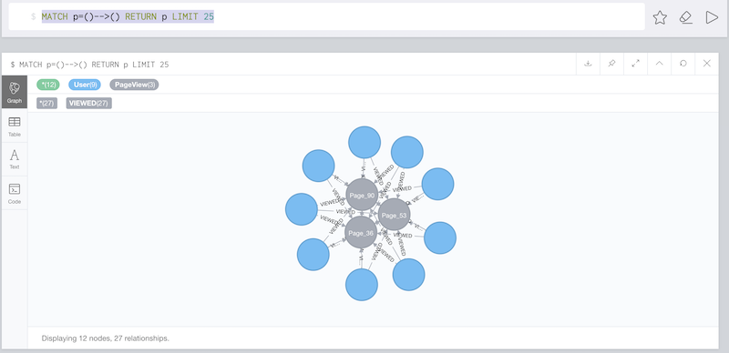
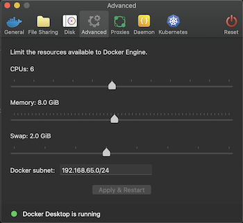

[#neo4j_confluent]
== Examples with Confluent Platform and Kafka Connect Datagen

=== Confluent and Neo4j in binary format

In this example Neo4j and Confluent will be downloaded in binary format and Neo4j Streams plugin
will be set up in SINK mode.
The data consumed by Neo4j will be genereated by the *Kafka Connect Datagen*. Please note the this connector
should be used just for test purposes and is not suitable for production scenarios.

==== Download and Install Confluent Platform

* Download link:https://www.confluent.io/download/[Confluent Platform] and then choose the desired format `.tar.gz` or `.zip`.
* Decompress the file in your desired folder
* Add the install location of the Confluent `bin` directory to your PATH environment variable.

[source, bash]
----
export PATH=<CONFLUENT_HOME_DIR>/bin:$PATH
----

* Run Confluent Platform using the following command:

[source, bash]
----
confluent local start
----

the output should be something like this:

[source, bash]
----
Starting zookeeper
zookeeper is [UP]
Starting kafka
kafka is [UP]
Starting schema-registry
schema-registry is [UP]
Starting kafka-rest
kafka-rest is [UP]
Starting connect
connect is [UP]
Starting ksql-server
ksql-server is [UP]
Starting control-center
control-center is [UP]
----

==== Download Neo4j

* Download the latest version of Neo4j at the following link https://neo4j.com/download-center/

* Decompress it in your desired folder

* Install Neo4j Streams plugin by copying the jar in the plugins folder

* Add the following properties to `neo4j.conf` in order to enable Sink functionality

.neo4j.conf
[source, properties]
----
kafka.zookeeper.connect=localhost:2181
kafka.bootstrap.servers=localhost:9092
kafka.auto.offset.reset=earliest
kafka.group.id=neo4j
kafka.enable.auto.commit=true
kafka.key.deserializer=org.apache.kafka.common.serialization.ByteArrayDeserializer
kafka.value.deserializer=org.apache.kafka.common.serialization.ByteArrayDeserializer

#********************************************************************
# Kafka Consumer
#********************************************************************
streams.sink.enabled=true
streams.sink.topic.cypher.pageviews=MERGE (n:User {id: event.payload.userid}) MERGE (p:PageView { id: event.payload.pageid }) MERGE (n)-[:VIEWED]->(p)
----

Configure deserializer accordingly to the choosen data format:

* _org.apache.kafka.common.serialization.ByteArrayDeserializer_ in case of *JSON* format
* _io.confluent.kafka.serializers.KafkaAvroDeserializer_ in case of *AVRO* format

If AVRO then a schema registry configuration is also needed:

[source, properties]
----
kafka.schema.registry.url=localhost:8081
----

where 8081 is the default port for the Confluent Schema Registry.

[NOTE]
If you started Neo4j before adding above properties, you need also to restart Neo4j server.

==== Install Kafka Connect Datagen

Install the link:https://www.confluent.io/hub/confluentinc/kafka-connect-datagen[Kafka Connect Datagen] using the Confluent Hub client.

[source,bash]
----
<CONFLUENT_HOME_DIR>/bin/confluent-hub install --no-prompt confluentinc/kafka-connect-datagen:latest
----

the output should be something like this:

[source, bash]
----
Running in a "--no-prompt" mode
Implicit acceptance of the license below:
Apache License 2.0
https://www.apache.org/licenses/LICENSE-2.0
Downloading component Kafka Connect Datagen 0.1.5, provided by Confluent, Inc. from Confluent Hub and installing into /Applications/Development/confluent-5.3.1/share/confluent-hub-components
...
Completed
----

[[view_results_example]]
==== View results

Now you can access to the Confluent Control Center at http://localhost:9021, you can create Kafka topics and generate some sample data.
Follow link:https://docs.confluent.io/current/quickstart/ce-quickstart.html#step-2-create-ak-topics[step 2] and
link:https://docs.confluent.io/current/quickstart/ce-quickstart.html#step-3-install-a-ak-connector-and-generate-sample-data[step 3]
of the official link:https://docs.confluent.io/current/quickstart/ce-quickstart.html[Confluent documentation]

When configuring the data generator connectors specify also the `Value converter class` property with the following value:

[source, properties]
----
org.apache.kafka.connect.json.JsonConverter
----

Accessing the Neo4j Browser at http://localhost:7474 you can see that Kafka messages generated by the *Kafka Connect Datagen* were
consumed and converted to nodes and relationship accordingly to the cypher specified in the property `streams.sink.topic.cypher.pageviews`.
Just execute the following cypher query:

[source, cypher]
----
MATCH p=()-->() RETURN p LIMIT 25
----

The output should be something like:

[#confluent_docker_example]
=== Confluent with Docker, Neo4j in binary format

In this example Neo4j will be installed locally and Confluent Platform will be in a Docker environment

==== Neo4j

Neo4j is installed and configure in the same way as above example

==== Confluent with Docker

In order to have a ready to use Confluent Platform with Docker, please use the following docker-compose file (**please note
that in the configuration of the `connect` service you have to substitute the `<version>` of kafka-connect-plugin you're going to install**):

.docker-compose.yml
[source,yaml]
----
version: '2'
services:

  zookeeper:
    image: confluentinc/cp-zookeeper
    hostname: zookeeper
    container_name: zookeeper
    ports:
      - "2181:2181"
    environment:
      ZOOKEEPER_CLIENT_PORT: 2181
      ZOOKEEPER_TICK_TIME: 2000

  broker:
    image: confluentinc/cp-enterprise-kafka
    hostname: broker
    container_name: broker
    depends_on:
      - zookeeper
    ports:
      - "9092:9092"
    expose:
    - "9093"
    environment:
      KAFKA_ADVERTISED_LISTENERS: PLAINTEXT://broker:9093,OUTSIDE://localhost:9092
      KAFKA_LISTENER_SECURITY_PROTOCOL_MAP: PLAINTEXT:PLAINTEXT,OUTSIDE:PLAINTEXT
      KAFKA_LISTENERS: PLAINTEXT://0.0.0.0:9093,OUTSIDE://0.0.0.0:9092
      CONFLUENT_METRICS_REPORTER_BOOTSTRAP_SERVERS: broker:9093

      # workaround if we change to a custom name the schema_registry fails to start
      KAFKA_INTER_BROKER_LISTENER_NAME: PLAINTEXT

      KAFKA_BROKER_ID: 1
      KAFKA_ZOOKEEPER_CONNECT: 'zookeeper:2181'
      KAFKA_METRIC_REPORTERS: io.confluent.metrics.reporter.ConfluentMetricsReporter
      KAFKA_OFFSETS_TOPIC_REPLICATION_FACTOR: 1
      KAFKA_GROUP_INITIAL_REBALANCE_DELAY_MS: 0
      CONFLUENT_METRICS_REPORTER_ZOOKEEPER_CONNECT: zookeeper:2181
      CONFLUENT_METRICS_REPORTER_TOPIC_REPLICAS: 1
      CONFLUENT_METRICS_ENABLE: 'true'
      CONFLUENT_SUPPORT_CUSTOMER_ID: 'anonymous'

  schema_registry:
    image: confluentinc/cp-schema-registry
    hostname: schema_registry
    container_name: schema_registry
    depends_on:
      - zookeeper
      - broker
    ports:
      - "8081:8081"
    environment:
      SCHEMA_REGISTRY_HOST_NAME: schema_registry
      SCHEMA_REGISTRY_KAFKASTORE_CONNECTION_URL: 'zookeeper:2181'

  connect:
    image: confluentinc/kafka-connect-datagen:latest
    hostname: connect
    container_name: connect
    depends_on:
      - zookeeper
      - broker
      - schema_registry
    ports:
      - "8083:8083"
    environment:
      CONNECT_BOOTSTRAP_SERVERS: 'broker:9093'
      CONNECT_REST_ADVERTISED_HOST_NAME: connect
      CONNECT_REST_PORT: 8083
      CONNECT_GROUP_ID: compose-connect-group
      CONNECT_CONFIG_STORAGE_TOPIC: docker-connect-configs
      CONNECT_CONFIG_STORAGE_REPLICATION_FACTOR: 1
      CONNECT_OFFSET_FLUSH_INTERVAL_MS: 10000
      CONNECT_OFFSET_STORAGE_TOPIC: docker-connect-offsets
      CONNECT_OFFSET_STORAGE_REPLICATION_FACTOR: 1
      CONNECT_STATUS_STORAGE_TOPIC: docker-connect-status
      CONNECT_STATUS_STORAGE_REPLICATION_FACTOR: 1
      CONNECT_KEY_CONVERTER: org.apache.kafka.connect.storage.StringConverter
      CONNECT_VALUE_CONVERTER: org.apache.kafka.connect.json.JsonConverter
      CONNECT_INTERNAL_KEY_CONVERTER: org.apache.kafka.connect.json.JsonConverter
      CONNECT_INTERNAL_VALUE_CONVERTER: org.apache.kafka.connect.json.JsonConverter
      CONNECT_ZOOKEEPER_CONNECT: 'zookeeper:2181'
      CONNECT_PLUGIN_PATH: /usr/share/java,/usr/share/confluent-hub-components
      CONNECT_LOG4J_LOGGERS: org.apache.zookeeper=DEBUG,org.I0Itec.zkclient=DEBUG,org.reflections=ERROR
    command:
      - bash
      - -c
      - |
        confluent-hub install --no-prompt neo4j/kafka-connect-neo4j:<version> && \
        confluent-hub install --no-prompt confluentinc/kafka-connect-datagen:latest
        /etc/confluent/docker/run

  control-center:
    image: confluentinc/cp-enterprise-control-center
    hostname: control-center
    container_name: control-center
    depends_on:
      - zookeeper
      - broker
      - schema_registry
      - connect
    ports:
      - "9021:9021"
    environment:
      CONTROL_CENTER_BOOTSTRAP_SERVERS: 'broker:9093'
      CONTROL_CENTER_ZOOKEEPER_CONNECT: 'zookeeper:2181'
      CONTROL_CENTER_CONNECT_CLUSTER: 'connect:8083'
      CONTROL_CENTER_REPLICATION_FACTOR: 1
      CONTROL_CENTER_INTERNAL_TOPICS_PARTITIONS: 1
      CONTROL_CENTER_MONITORING_INTERCEPTOR_TOPIC_PARTITIONS: 1
      CONFLUENT_METRICS_TOPIC_REPLICATION: 1
      PORT: 9021

----

[NOTE]
====
You must allocate a minimum of 8 GB of Docker memory resource in order to avoid *Exit Code 137 (Out Of Memory Error)* on the connect container

====

To see the results follow the instruction explained in above <<view_results_example, View results>> section.