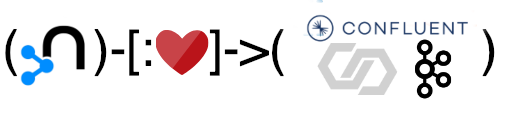
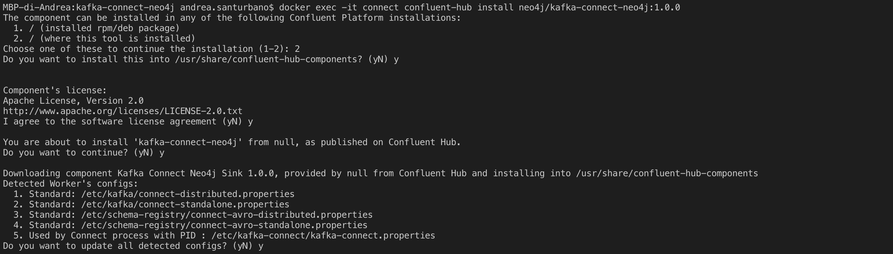

== Kafka Connect Plugin
:environment: neo4j
:id: neo4j

ifdef::env-docs[]
[abstract]
--
This chapter describes Kafka Connect plugins in the Neo4j Streams Library.
--
endif::env-docs[]

Kafka Connect, an open source component of Apache Kafka, is a framework for connecting Kafka with external systems such as databases, key-value stores, search indexes, and file systems.

The Neo4j Streams project provides a Kafka Connect plugin that can be installed into the Confluent Platform enabling:

- Ingest data from Kafka topics directly into Neo4j via templated Cypher queries;
- Stream Neo4j transaction events (*coming soon*).

=== Plugin installation

You can choose your preferred way in order to install the plugin

==== Download and install the plugin via Confluent Hub client

If you are using the provided compose file you can easily install the plugin by using the Confluent Hub.

Once the compose file is up and running you can install the plugin by executing the following command:

[source,bash]
----
<confluent_platform_dir>/bin/confluent-hub install neo4j/kafka-connect-neo4j:<version>
----

When the installation will ask:

[source,bash]
----
The component can be installed in any of the following Confluent Platform installations:
----

Please prefer the solution `(where this tool is installed)` and then go ahead with the default options.

Following an example:

At the end of the process the plugin is automatically installed.

==== Download the zip from the Confluent Hub

Please go to the Confluent Hub page of the plugin:

https://www.confluent.io/connector/kafka-connect-neo4j-sink/

And click to the **Download Connector** button.

Once you downloaded the file please place it into your Kafka Connect `plugins` dir.

==== Build it locally

Download the project from Github:

    git clone https://github.com/neo4j-contrib/neo4j-streams.git

Go into the `neo4j-streams` directory:

    cd neo4j-streams

Build the project by running the following command:

    mvn clean install

Inside the directory `<neo4j-streams>/kafka-connect-neo4j/target/component/packages` you'll find a file named `neo4j-kafka-connect-neo4j-<VERSION>.zip`, please unpackage and place it into your Kafka Connect `plugins` dir.

[#kafka-connect-sink-instance]
=== Create the Sink Instance

Create the Sink instance:

We'll define the Sink configuration in several ways:

* by providing a Cypher template
* by ingesting the events emitted from another Neo4j instance via the Change Data Capture module
* by providing a pattern extraction to a JSON or AVRO file
* by managing a CUD file format

==== Cypher template

[source,json]
----
include::../../../kafka-connect-neo4j/docker/contrib.sink.avro.neo4j.json[]
----

In particular this line:

[source,ini,subs="verbatim,attributes"]
----
"{environment}.topic.cypher.my-topic": "MERGE (p:Person{name: event.name, surname: event.surname}) MERGE (f:Family{name: event.surname}) MERGE (p)-[:BELONGS_TO]->(f)"
----

defines that all the data that comes from the topic `my-topic` will be unpacked by the Sink into Neo4j with the following Cypher query:

[source,cypher]
----
MERGE (p:Person{name: event.name, surname: event.surname})
MERGE (f:Family{name: event.surname})
MERGE (p)-[:BELONGS_TO]->(f)
----

Under the hood the Sink inject the event object in this way

[source,cypher]
----
UNWIND {batch} AS event
MERGE (p:Person{name: event.name, surname: event.surname})
MERGE (f:Family{name: event.surname})
MERGE (p)-[:BELONGS_TO]->(f)
----

Where `{batch}` is a list of event objects.

You can change the query or remove the property and add your own, but you must follow the following convention:

[source,json,subs="verbatim,attributes"]
----
"{environment}.topic.cypher.<YOUR_TOPIC>": "<YOUR_CYPHER_QUERY>"
----

Let's load the configuration into the Confluent Platform with this REST call:

[source,shell]
----
curl -X POST http://localhost:8083/connectors \
  -H 'Content-Type:application/json' \
  -H 'Accept:application/json' \
  -d @contrib.sink.avro.neo4j.json
----

The file `contrib.sink.string-json.neo4j.json` contains a configuration that manage a simple JSON producer example

Please check that everything is fine by going into:

http://localhost:9021/management/connect

and click to the **Sink** tab. You must find a table just like this:

[cols="4*",options="header"]
|===
|Status
|Active Tasks
|Name
|Topics

|Running
|1
|Neo4jSinkConnector
|my-topic
|===

[NOTE]
====
Note that the Sink instance can be configured also to monitor multiple topics. Just evaluate the property `**topics**`
with a list of topic separated by comma. For example:

[source,json]
----
{
  "name": "Neo4jSinkConnector",
  "config": {
    "connector.class": "streams.kafka.connect.sink.Neo4jSinkConnector",
    "key.converter": "org.apache.kafka.connect.storage.StringConverter",
    "value.converter": "org.apache.kafka.connect.json.JsonConverter",
    "value.converter.schemas.enable": false,
    "topics": "topicA,topicB",
    "_comment": "Cypher template example configuration",
    "neo4j.topic.cypher.topicA": "<YOUR_CYPHER_QUERY>",
    "neo4j.topic.cypher.topicB": "<YOUR_CYPHER_QUERY>",
    "errors.retry.timeout": "-1",
    "errors.retry.delay.max.ms": "1000",
    "errors.tolerance": "all",
    "errors.log.enable": true,
    "errors.log.include.messages": true,
    "neo4j.server.uri": "bolt://neo4j:7687",
    "neo4j.authentication.basic.username": "neo4j",
    "neo4j.authentication.basic.password": "password",
    "neo4j.encryption.enabled": false
  }
}
----

====

[#kafka-connect-sink-strategies]
include::../sink-strategies/index.adoc[]

[#kafka-connect-cud-file-format]
include::../cud-file-format/index.adoc[]

=== How deal with bad data

In Kafka Connect plugin, in the creation phase of the Sink instance, in addition to the properties
described in the <<dlq-table, Dead Letter Queue configuration paramaters table>>, you need to define kafka broker connection properties:

|===
| Name | mandatory | Description

| kafka.bootstrap.servers | true | It's the Kafka Broker url. *(please look at the description below)

| kafka.<any_other_kafka_property> | false | You can also specify any other kafka Producer
setting by adding the `kafka.` prefix (i.e the configuration `acks` become `kafka.acks`). See the https://kafka.apache.org/documentation/#brokerconfigs[Apache Kafka documentation] for details on these settings.

|===

As you may have noticed we're asking to provide the `bootstrap.server` property,
this because the Kafka Connect Framework provides an out-of-the-box support
only for deserialization errors and message transformations
(please look into the following link for further details: https://www.confluent.io/blog/kafka-connect-deep-dive-error-handling-dead-letter-queues).
We want to extend this feature for transient errors in order to cover the 100% of failures.
So to do that at this moment as suggested by Confluent we need to ask again the broker location,
until this JIRA issue will not be addressed: https://issues.apache.org/jira/browse/KAFKA-8597.
Said that, these properties has to be added only if you want to also redirect Neo4j errors into the DLQ.

=== Monitor via Confluent Platform UI

The Kafka Monitoring UI can be found at http://<localhost>:9021/management/connect

image::../../images/confluent-metrics.png[title="Confluent Importing Metrics", align="center"]

They show up properly in my topic, and then are added to Neo4j via the sink.

Below you see the data that has been ingested into Neo4j. During my testing I got up to more than 2M events.

image::../../images/confluent-imported-data.png[title="Confluent Platform Management", align="center"]

include::config-override-policy/index.adoc[]