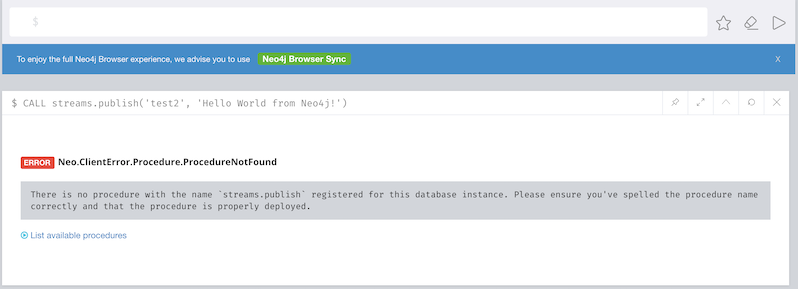

[#neo4j_streams_procedures]
== Neo4j Streams - Procedures
:environment: streams

ifdef::env-docs[]
[abstract]
--
This chapter describes the Neo4j Streams Procedures in the Neo4j Streams Library.
Use this section to configure Neo4j to know how procedures allow the functionality of the plugin
to be used ad-hoc in any Cypher query.
--
endif::env-docs[]

The Streams project comes out with a list of procedures.

=== Configuration

You can enable/disable the procedures by changing this variable inside the `neo4j.conf`

.neo4j.conf
[subs="verbatim,attributes"]
----
{environment}.procedures.enabled=<true/false, default=true>
----

[NOTE]
====
Please note that by default the `dbms.security.procedures.whitelist` property is disabled, so Neo4j will load all
procedures found.
If you enable it then you have also to declare a comma separated list of procedures to be loaded by default. For example:

[source, properties]
----
dbms.security.procedures.whitelist=streams.*,apoc.*
----

If you try to CALL one of the Streams procedures without declaring them into the whitelist, you will receive an error like
the following:

====

=== streams.publish

This procedure allows custom message streaming from Neo4j to the configured environment by using the underlying configured Producer.

Uses:

`CALL streams.publish('my-topic', 'Hello World from Neo4j!')`

The message retrieved from the Consumer is the following:

`{"payload":"Hello world from Neo4j!"}`

If you use a local <<neo4j_streams_docker,docker (compose) setup>>, you can check for these messages with:

`docker exec -it kafka kafka-console-consumer --topic my-topic --bootstrap-server kafka:9092`

Input Parameters:

[cols="3*",options="header"]
|===
|Variable Name
|Type
|Description

|`topic`
|String
|The topic where you want to publish the data

|`payload`
|Object
|The data that you want to stream

|===

Configuration parameters:
[cols="3*",options="header"]
|===
|Name
|Type
|Description

|`key`
|Object
|The key value of message that you want to stream. Please note that if the key doesn't exist, you get a message with a random UUID as key value

|`partition`
|Int
|The partition of message that you want to stream

|===

You can send any kind of data in the payload, nodes, relationships, paths, lists, maps, scalar values and nested versions thereof.

In case of nodes or relationships if the topic is defined in the patterns provided by the configuration their properties will be filtered in according with the configuration.

=== streams.publish.sync

Similar to `streams.publish` procedure, but in a synchronous way.

Uses:

`CALL streams.publish.sync('my-topic', 'my-payload', {<config>}) YIELD value RETURN value`

This procedure return a `RecordMetadata` value like this `{"timestamp": 1, "offset": 2, "partition", 3, "keySize", 4, "valueSize", 5}`

[cols="2*",options="header"]
|===
|Variable Name
|Description

|`timestamp`
|The timestamp of the record in the topic/partition.

|`offset`
|The offset of the record in the topic/partition.

|`partition`
|The partition the record was sent to

|`keySize`
|The size of the serialized, uncompressed key in bytes

|`valueSize`
|The size of the serialized, uncompressed value in bytes
|===

=== streams.consume

This procedure allows to consume messages from a given topic.

Uses:

`CALL streams.consume('my-topic', {<config>}) YIELD event RETURN event`

Example:
Imagine you have a producer that publish events like this `{"name": "Andrea", "surname": "Santurbano"}`, we can create user nodes in this way:

[source,cypher]
----
CALL streams.consume('my-topic') YIELD event
CREATE (p:Person{firstName: event.data.name, lastName: event.data.surname})
----

In case you want to read a specific offset of a topic partition you can do it by executing the following query:

[source,cypher]
----
CALL streams.consume('my-topic', {timeout: 5000, partitions: [{partition: 0, offset: 30}]}) YIELD event
CREATE (p:Person{firstName: event.data.name, lastName: event.data.surname})
----

Input Parameters:

[cols="3*",options="header"]
|===
|Variable Name
|Type
|Description

|`topic`
|String
|The topic where you want to publish the data

|`config`
|Map<K,V>
|The configuration parameters

|===

==== Available configuration parameters

[cols="3*",options="header"]
|===
|Variable Name
|Type
|Description

|`timeout`
|Number (default `1000`)
|Define the time that the procedure should be listen the topic

|`from`
|String
|It's the Kafka configuration parameter `auto.offset.reset`.
If not specified it inherits the underlying `kafka.auto.offset.reset` value

|`groupId`
|String
|It's the Kafka configuration parameter `group.id`.
If not specified it inherits the underlying `kafka.group.id` value

|`autoCommit`
|Boolean (default `true`)
|It's the Kafka configuration parameter `enable.auto.commit`.
If not specified it inherits the underlying `kafka.enable.auto.commit` value

|`commit`
|Boolean (default `true`)
|In case of `autoCommit` is set to `false` you can decide if you want to commit the data.

|`zookeeper`
|String
|The comma separated string of Zookeeper nodes url.
If not specified it inherits the underlying `kafka.zookeeper.connect` value

|`broker`
|String
|The comma separated string of Kafka nodes url.
If not specified it inherits the underlying `kafka.bootstrap.servers` value

|`partitions`
|List<Map<K,V>>
|The map contains the information about partition and offset in order to start reading from a

|`keyDeserializer`
|String
|The supported deserializer for the Kafka Record Key
If not specified it inherits the underlying `kafka.key.deserializer` value.
Supported deserializers are: `org.apache.kafka.common.serialization.ByteArrayDeserializer` and `io.confluent.kafka.serializers.KafkaAvroDeserializer`

|`valueDeserializer`
|String
|The supported deserializer for the Kafka Record Value
If not specified it inherits the underlying `kafka.value.deserializer` value
Supported deserializers are: `org.apache.kafka.common.serialization.ByteArrayDeserializer` and `io.confluent.kafka.serializers.KafkaAvroDeserializer`

|`schemaRegistryUrl`
|String
|The schema registry url, required in case you are dealing with AVRO messages.

|===

==== Partitions

[cols="3*",options="header"]
|===
|Variable Name
|Type
|Description

|`partition`
|Number
|It's the Kafka partition number to read

|`offset`
|Number
|It's the offset to start to read the topic partition

|===

=== Streams Sink Lifecycle procedure

We provide a set of procedures in order to manage the Sink lifecycle.

[cols="2*",options="header"]
|===
|Proc. Name
|Description

|`CALL streams.sink.stop() YIELD name, value`
| stops the Sink, and return the status, with the error if one occurred during the process

|`CALL streams.sink.start() YIELD name, value`
| starts the Sink, and return the status, with the error if one occurred during the process

|`CALL streams.sink.restart() YIELD name, value`
| restart the Sink, and return the status, with the error if one occurred during the process

|`CALL streams.sink.config() YIELD name, value`
| returns the Sink config, please check the table "Streams Config"

|`CALL streams.sink.status() YIELD name, value`
| returns the status
|===

[NOTE]
Please consider that in order to use this procedures you must enable the streams procedures and they are runnable only on the leader.

.Streams Config
[cols="2*",options="header"]
|===
|Config Name
|Description

|invalid_topics
|return a list of invalid topics

|streams.sink.topic.pattern.relationship
|return a Map<K,V> where the K is the topic name and V is the provided pattern

|streams.sink.topic.cud
|return a list of topics defined for the CUD format

|streams.sink.topic.cdc.sourceId
|return a list of topics defined for the CDC SourceId strategy

|streams.sink.topic.cypher
|return a Map<K,V> where the K is the topic name and V is the provided Cypher Query

|streams.sink.topic.cdc.schema
|return a list of topics defined for the CDC Schema strategy

|streams.sink.topic.pattern.node
|return a Map<K,V> where the K is the topic name and V is the provided pattern

|streams.sink.errors
|return a Map<K,V> where the K sub property name, and V is the value

|streams.sink.source.id.strategy.config
|returns the config for the SourceId CDC strategy
|===
